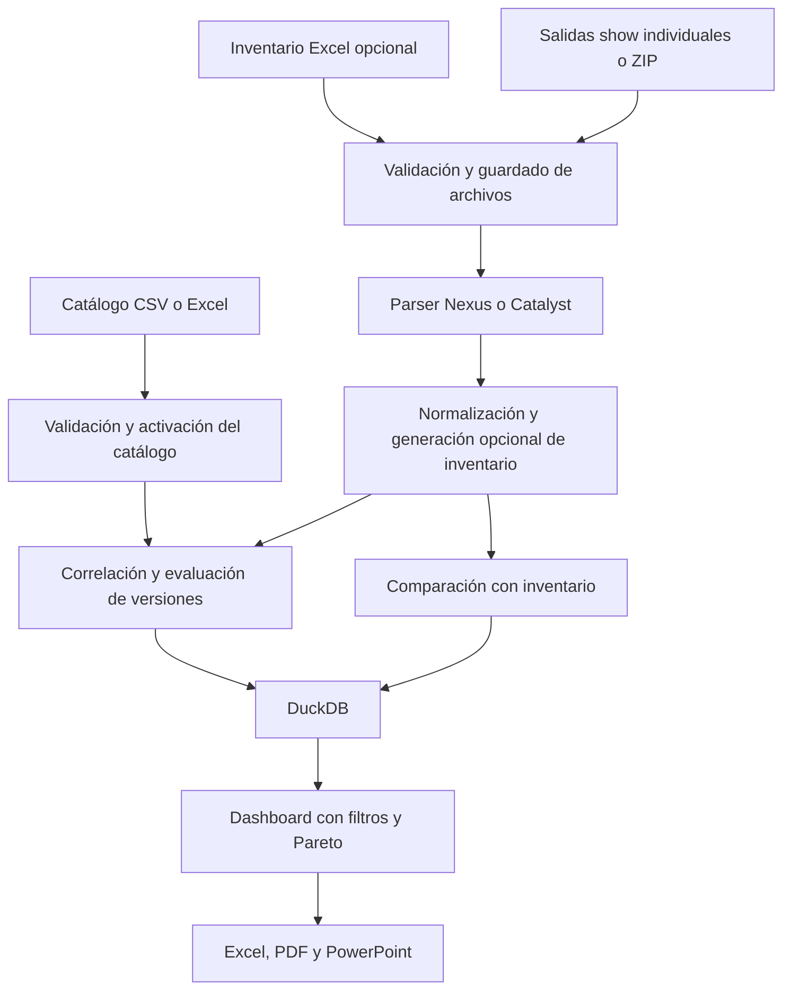

# BugScrub: descripción verificada y preparación para pruebas

Fecha de revisión: **27 de septiembre de 2026**. Versión declarada: `0.1.0`.

Este documento describe el código presente en la carpeta, las verificaciones realizadas y el trabajo recomendado antes de desplegar en un droplet de DigitalOcean. La revisión no modificó la lógica de la aplicación ni realizó un despliegue. La base existente se consultó en modo de solo lectura; las pruebas usaron sus propios archivos temporales.

## 1. Descripción del sistema

**BugScrub Local-First es una aplicación web de análisis asistido para equipos Cisco. Cruza un catálogo estructurado de incidencias con la identidad, el software y las funcionalidades detectadas en archivos de comandos de red. Construye inventario, detecta discrepancias, prioriza posibles incidencias y presenta dashboards interactivos y reportes.**

El usuario aporta dos grupos de información:

1. **Conocimiento de incidencias:** un catálogo CSV o Excel adaptado al esquema de BugScrub, con identificadores, plataformas, versiones afectadas y corregidas, funcionalidades, severidad y acciones recomendadas.
2. **Evidencia de los equipos:** salidas de cuatro comandos, individualmente o en un ZIP con carpetas por equipo. Puede añadir un inventario Excel de referencia; si lo omite, la aplicación genera uno a partir de esas salidas.

El análisis es determinista, basado en expresiones regulares, normalización y reglas Python. No se encontró un modelo de IA, conexión SSH a los equipos, descubrimiento activo de la red ni ejecución de cambios de configuración. En la interfaz, «descubierto» significa extraído de los archivos cargados.

La aplicación funciona localmente y el análisis no necesita conectarse a Cisco. En un droplet, los archivos y resultados quedarían alojados en ese servidor: el procesamiento seguiría siendo offline respecto a Cisco, pero ya no estaría en la computadora del usuario.

### Precisión sobre Field Notices, PSIRT y documentos originales

La descripción inicial requiere este matiz: **hoy no existe una ingestión general de documentos Cisco en PDF, Word, HTML o texto libre**. Tampoco hay un importador específico para cada formato de Field Notice, PSIRT o exportación del Bug Search Tool.

La interfaz permite filtrar Bug/CVE/FN/PSIRT porque el dashboard infiere el tipo a partir del identificador o del título. Todos pasan por el mismo esquema tabular y el mismo motor. Un Field Notice puede representarse manualmente en ese esquema, pero no se evalúan criterios propios como rangos de números de serie, fechas de fabricación o revisiones de hardware.

Cisco documenta que Bug Search Tool puede exportar a Excel, pero esto no demuestra compatibilidad directa con las ocho columnas requeridas aquí; hace falta validar o transformar ese archivo. Cisco también documenta verificaciones de aplicabilidad por número de serie para ciertos Field Notices. Estas son capacidades distintas que conviene modelar explícitamente. Fuentes: [Bug Search Tool Help](https://www.cisco.com/c/en/us/support/web/tools/bst/bsthelp/index.html) y [Field Notice FAQ](https://www.cisco.com/c/en/us/support/field-notices/faq.html).

## 2. Arquitectura y flujo real

Es una aplicación monolítica de Python: Streamlit ejecuta la interfaz y coordina las operaciones; los módulos internos hacen el procesamiento; DuckDB almacena los datos en un archivo. No hay un backend HTTP separado, cola de trabajos ni servicio de base de datos externo.



Secuencia al enviar una carga:

1. Valida extensión, tamaño y contenido básico de los archivos de inventario/comandos.
2. Crea una carpeta de sesión con fecha UTC e identificador aleatorio; guarda archivos y extrae el ZIP si lo hay.
3. Aplica el parser elegido a los paquetes encontrados.
4. Lee el inventario o genera `generated_inventory.xlsx`.
5. Normaliza equipos e inventario a registros canónicos.
6. Compara inventario declarado y evidencia extraída.
7. Obtiene el catálogo activo y correlaciona incidencias.
8. Persiste sesión, equipos, inventario, discrepancias y hallazgos.
9. Conserva los resultados visibles en `st.session_state`, construye el dashboard y genera exportaciones.

Los filtros actualizan las vistas y los reportes ejecutivos, pero no vuelven a ejecutar el motor de correlación. Activar otro catálogo tampoco recalcula automáticamente una sesión ya procesada.

### Mapa de componentes

| Ruta | Responsabilidad comprobada |
| --- | --- |
| `streamlit_app.py` | Arranque, configuración y registro de eventos. |
| `src/bugscrub/ui/pages.py` | Catálogos, carga, coordinación del procesamiento, dashboard y descargas. |
| `src/bugscrub/intake/uploads.py` | Contratos de carga, límites, validaciones y extracción ZIP. |
| `src/bugscrub/parsers/` | Extracción de identidad, versión, componentes y funcionalidades. |
| `src/bugscrub/normalization/` | Modelo canónico, lectura del inventario y generación de Excel. |
| `src/bugscrub/discrepancies/service.py` | Emparejamiento de equipos y discrepancias. |
| `src/bugscrub/bug_engine/dataset.py` | Lectura de catálogos y cuatro registros internos de respaldo. |
| `src/bugscrub/bug_engine/service.py` | Correlación, evaluación de remediación y puntuación. |
| `src/bugscrub/bug_engine/risk_summary.py` | Filtros, métricas, agrupaciones y Pareto. |
| `src/bugscrub/db/duckdb_store.py` | Esquema, almacenamiento y consulta de DuckDB. |
| `src/bugscrub/exporters/` | Excel operativo, PDF y PowerPoint ejecutivos. |
| `src/bugscrub/observability.py` | Eventos y excepciones en JSONL. |
| `src/bugscrub/security/`, `cisco_api/` | Estructuras preliminares de políticas, secretos y API. |
| `src/bugscrub/deploy_control.py`, `deploy_tui.py` | Herramientas de operación para Docker Hub y Google Cloud Run. |
| `docs/` | Documentación, prototipo anterior y material de referencia/clientes. |
| `network-documents/` | Paquetes de demostración Nexus, Catalyst y mixtos; artefactos previos de pruebas. |

`bug_engine/rules.py` conserva valores `pending`: las reglas operativas están implementadas en `service.py` y `risk_summary.py`. El prototipo `docs/cisco_bug_scrub_v2.py` no es el punto de entrada de la aplicación actual.

## 3. Entradas y contratos

### Evidencia de equipos

| Entrada | Formatos efectivos | Límite en el validador |
| --- | --- | --- |
| Inventario opcional | `.xlsx`, `.xlsm` | 15 MiB por archivo |
| `show version` | `.txt`, `.log`, `.cfg`, `.conf` | 5 MiB |
| `show inventory` | Los mismos formatos de texto | 5 MiB |
| `show running-config` | Los mismos formatos de texto | 5 MiB |
| `show module` | Los mismos formatos de texto | 5 MiB |
| Paquete de varios equipos | `.zip` | 75 MiB comprimidos |
| Catálogo de incidencias | `.csv`, `.xlsx`, `.xlsm` | Sin límite específico propio; rige la configuración general de Streamlit de 75 MB |

Aunque `.xls` aparece en el selector de inventario, el validador lo rechaza expresamente. No hay soporte implementado para `.xlsb`, PDF o Word como entradas del análisis.

Para un equipo, se requieren los cuatro archivos de comandos. Un inventario Excel por sí solo no completa una carga válida. Para varios equipos, la estructura esperada es:

```text
equipos.zip
  equipo-01/
    show_version.txt
    show_inventory.txt
    show_running_config.txt
    show_module.txt
  equipo-02/
    show_version.txt
    show_inventory.txt
    show_running_config.txt
    show_module.txt
```

El descubrimiento de paquetes busca `show_version.*`. Conviene conservar estos nombres exactos y en minúsculas para Linux. No existe un separador general de un archivo `show tech` monolítico en los cuatro comandos.

**Se elige una sola familia por sesión**, Nexus o Catalyst. La existencia de ejemplos mixtos en la carpeta no implica detección automática de familia por equipo dentro del mismo ZIP.

### Inventario

Normaliza alias de columnas para `hostname`, `model`, `pid`, `serial`, `os_version`, `target_version`, `site`, `role`, `family`, `features` y `business_criticality`. Selecciona una hoja candidata; no consolida automáticamente todas las hojas del libro.

La hoja `Candidate_Bugs` que aparece en plantillas no se convierte automáticamente en el catálogo activo: el catálogo se carga mediante el formulario independiente.

### Catálogo de incidencias

Columnas obligatorias, admitiendo los alias programados:

```text
bug_id, headline, product_scope, affected_releases,
fixed_releases, trigger_features, severity, recommended_action
```

Columnas opcionales: `platform_pids`, `required_features`, `optional_features`.

En cada fila se exige contenido en identificador, título, plataforma, versiones afectadas y severidad. Las otras columnas deben existir, aunque algunas puedan tener celdas vacías. Las filas incompletas se omiten con avisos. Las listas admiten separadores como punto y coma, coma, salto de línea o barra vertical.

El catálogo activo es global para toda la base. Se almacenan varios catálogos, pero solo uno se usa como activo. Sin uno cargado, se emplean **cuatro registros embebidos**, cuya procedencia y vigencia Cisco no están acreditadas en el código; deben tratarse como material de demostración hasta validarlos.

No hay actualización programada, control de antigüedad ni trazabilidad de URL/documento oficial por incidencia. La importación tampoco impone unicidad de `bug_id` antes de activar el catálogo, aunque `bug_catalog` sí tiene esa clave primaria.

## 4. Alcance de los parsers y del análisis

### Plataformas

| Familia | Implementación | Funcionalidades detectadas por patrones |
| --- | --- | --- |
| Nexus / NX-OS | Nivel interno `robust`, con pruebas de los cuatro comandos | VXLAN, EVPN, BGP, vPC, OSPF, PBR y QoS |
| Catalyst / IOS XE | Nivel interno `basic`, con pruebas de los cuatro comandos | STP, HSRP, OSPF, BGP, VLAN, EtherChannel y QoS |

`robust` es una etiqueta interna, no una certificación de cobertura de todas las plataformas o versiones Nexus. Los parsers usan heurísticas y expresiones regulares. Los documentos de WLC, ISE o firewalls existentes en `docs/Examples` no acreditan soporte de esas familias.

Los parsers extraen componentes de hardware, pero el motor correlaciona principalmente el PID y las funcionalidades del registro del equipo. No recorre todos los componentes para evaluar Field Notices por módulo o número de serie.

### Discrepancias

Se emparejan registros por serial y hostname, con heurísticas adicionales de plataforma. Se comparan hostname, modelo, PID, serial, versión y funcionalidades. Los resultados son `discrepancia`, `faltante` o `nuevo`, con filas emparejadas de origen `cliente` y `descubierto`.

Cuando el inventario se genera a partir de los mismos comandos, no representa una referencia independiente para detectar discrepancias. La interfaz distingue este origen en las métricas generales.

### Correlación de incidencias

Para cada equipo y entrada del catálogo, el motor evalúa:

1. Familia de plataforma y PID opcional, con coincidencia exacta o prefijo terminado en `*`.
2. Funcionalidades obligatorias, opcionales y disparadoras. Las obligatorias deben estar presentes; las disparadoras tradicionales requieren alguna coincidencia cuando no hay obligatorias.
3. Versión actual y, cuando se obtiene del inventario, versión objetivo.
4. Estado de remediación y puntuación, conservando las razones de coincidencia.

Admite versiones exactas, prefijos `*`/`x`, comparadores y rangos simples. La comparación tokeniza números y letras; no utiliza un modelo oficial de ramas de software Cisco.

| Estado | Interpretación en el código |
| --- | --- |
| `affected` | Coincide la versión actual con el alcance afectado y no se confirma corrección en la versión objetivo. |
| `fixed_in_target` | La versión actual coincide y la objetivo se considera corregida. |
| `already_fixed` | La versión actual coincide con una corregida o se considera posterior. |
| `needs_review` | Alguna expresión de versión no pudo interpretarse. |
| `not_applicable` | No se crea un hallazgo. |

La acción recomendada proviene del catálogo: no se calcula un plan completo de migración ni se validan compatibilidad, ISSU, hardware o ruta de actualización.

### Puntuación y límites de interpretación

La puntuación base del hallazgo es `10 × max(1, 7 − severidad) + 5 × número de criterios coincidentes`, con severidad predeterminada 4 si no se puede convertir a entero. Después se aplica un factor: `affected=1`, `needs_review=0.75`, `fixed_in_target=0.5`, `already_fixed=0.25`.

El resumen por equipo vuelve a aplicar el factor y añade penalizaciones por discrepancias: 15 por discrepancia, 10 por faltante y 8 por nuevo, cuando el par queda asociado al equipo en la vista. Las bandas son High desde 70, Medium desde 35, Low por encima de 0 y None en 0. La criticidad de negocio se almacena, pero no participa en esa fórmula.

Comportamientos comprobados que requieren decisión funcional:

- **Doble ponderación:** un hallazgo de prueba con `fixed_in_target` obtiene 32 en el motor y contribuye 16 en el dashboard. Puede ser intencional, pero actualmente no está explicado como dos descuentos diferentes.
- **Versión desconocida:** en una comprobación aislada, una versión actual vacía produjo `not_applicable`, no `needs_review`. Esto puede confundir falta de evidencia con ausencia de coincidencias.
- **Herencia de correcciones:** con una corrección registrada en `10.2(5)`, `10.3(1)` se consideró `already_fixed` por comparación de orden. Debe validarse esa inferencia entre ramas.
- **Versión objetivo:** la búsqueda del inventario para el motor usa serial, hostname y finalmente el primer PID coincidente. Un PID compartido por varios equipos puede asociar una versión objetivo incorrecta cuando faltan identificadores únicos.
- **Conteos de impacto:** los hallazgos `already_fixed` siguen presentes; varios conteos incluyen todos los hallazgos y no equivalen a incidencias activas confirmadas.
- **Pareto:** el análisis rápido suma el riesgo total de los equipos asociados a cada incidencia. Si un equipo tiene varias incidencias, su riesgo puede contribuir a varias barras. El porcentaje no debe interpretarse como una partición única del riesgo de la red.

Estos puntos se basan en `bug_engine/service.py` y `bug_engine/risk_summary.py`; no se modificaron durante esta revisión.

## 5. Dashboards y entregables

El dashboard implementa nueve filtros: equipo, plataforma, versión actual, funcionalidad, identificador, tipo de hallazgo, severidad, modelo y «firmware». Este último usa `target_version`, por lo que su nombre puede inducir a confusión. No hay filtros de ubicación ni criticidad de negocio, aunque aparezcan en objetivos antiguos.

Incluye métricas de inventario y discrepancias, equipos con hallazgos, barras apiladas por incidencia y plataforma, treemap, tablas de detalle, ranking de equipos, principales incidencias y Pareto con umbral ajustable entre 10 % y 100 %. Las métricas generales de inventario se calculan antes de los filtros; las métricas de impacto y detalles usan la selección.

| Salida | Alcance comprobado |
| --- | --- |
| Excel operativo | Hojas `Discrepancias` y `Bug Findings`, con datos completos de la sesión. |
| Descargas tabulares | CSV, JSON y Excel para las tablas correspondientes, incluidos detalles filtrados. |
| Inventario generado | Descarga del Excel construido desde los comandos. |
| PDF ejecutivo | Texto y gráficos que resumen el dashboard filtrado. |
| PowerPoint ejecutivo | Texto editable y gráficos insertados como imágenes; no todos los elementos son gráficos nativos editables. |
| Análisis rápido Pareto | Descargas específicas del análisis y reportes asociados. |

No debe asumirse que toda exportación respeta los filtros: el Excel operativo consulta los registros completos de la sesión; PDF/PPTX usan el estado filtrado del dashboard.

Los reportes principales se generan tanto en memoria como en disco al renderizar la sección. Por ello, cambiar filtros puede regenerarlos y sobrescribir los mismos nombres de archivo. Hay una oportunidad concreta de reducir trabajo duplicado, generar bajo demanda y conservar snapshots identificados por filtros.

## 6. Persistencia y estado observado

| Tabla DuckDB | Contenido | Filas existentes al revisar |
| --- | --- | ---: |
| `import_sessions` | Sesiones de importación | 16 |
| `normalized_devices` | Equipos normalizados por sesión | 632 |
| `normalized_inventory_rows` | Inventario normalizado por sesión | 632 |
| `discrepancy_rows` | Filas de comparación | 0 |
| `bug_datasets` | Metadatos de catálogos | 2 |
| `bug_dataset_entries` | Entradas de todos los catálogos | 17 |
| `bug_catalog` | Catálogo activo materializado | 11 |
| `bug_findings` | Hallazgos por sesión y equipo | 337 |

Las 16 sesiones existentes están etiquetadas como Nexus. Las 632 filas son registros acumulados entre sesiones: no acreditan 632 equipos únicos ni una prueba de carga de ese tamaño. Los valores son una instantánea, no una validación de la veracidad de los datos almacenados.

Rutas habituales:

- `storage/bugscrub.duckdb`: base de aproximadamente 59.5 MiB en esta revisión.
- `storage/runtime/uploads/`: archivos originales y paquetes extraídos por sesión.
- `storage/runtime/bug-datasets/`: catálogos cargados.
- `storage/runtime/exports/`: entregables por sesión.
- `storage/runtime/logs/bugscrub.jsonl`: registro estructurado de eventos.

Limitaciones comprobadas:

- Se persisten sesiones, pero no existe un flujo completo para reabrirlas o compararlas en la interfaz. La vista activa depende de `st.session_state`.
- Las sesiones y los hallazgos no registran `dataset_id`, hash del catálogo o versión de las reglas. No se puede reconstruir inequívocamente qué catálogo activo produjo cada análisis.
- `fetch_bug_catalog()` reconstruye la tabla activa mediante borrado e inserción; una lectura aparente hace escrituras.
- Los guardados de varias tablas y la activación de catálogos no están envueltos en una transacción explícita. Debe revisarse el comportamiento ante interrupciones y acceso concurrente.
- No se encontró identidad de usuario, organización/cliente ni control de permisos por sesión. El catálogo activo y el listado de sesiones son compartidos.
- No se implementan rotación de logs, caducidad de cargas ni limpieza automática de exportaciones.

## 7. Seguridad, API y empaquetado: alcance real

La API Cisco está desactivada por defecto. `CiscoApiClient.fetch_bugs()` devuelve una lista vacía; no implementa OAuth ni consulta de incidencias. El gateway de políticas no se conecta al flujo principal de la interfaz.

`ApiPolicy` contiene dos booleanos y una comprobación. `preferred_secret_path()` devuelve la ruta recibida; no carga secretos. No se encontraron pantallas de activación de API o gestión de políticas ni lectura efectiva del `policy.yaml`. Las credenciales de la configuración se obtienen de variables de entorno. La documentación histórica que presenta todo lo anterior como implementado debe interpretarse como intención de diseño.

El empaquetado sí incluye:

- Imagen basada en `python:3.11-slim`, instalación del paquete y entrada Streamlit.
- Servicio Compose con reinicio `unless-stopped`, puerto 8501 y volúmenes persistentes.
- Perfil de pruebas Docker y health check `/_stcore/health`.
- Montaje de `storage` con escritura; `data` y `secrets` de solo lectura.

Condiciones relevantes antes de alojarlo en un servidor:

- No hay autenticación de la aplicación ni aislamiento entre clientes.
- El puerto de Compose se publica sin restringirlo a localhost.
- `docker/entrypoint.sh` desactiva expresamente CORS y XSRF. La documentación de Streamlit describe ambas protecciones; su configuración debe probarse con el dominio/proxy elegido y con la versión instalada. Fuente: [configuración de Streamlit](https://docs.streamlit.io/develop/api-reference/configuration/config.toml).
- El Dockerfile no define un usuario sin privilegios ni límites de recursos en Compose.
- La validación ZIP limita el tamaño comprimido, pero no el total descomprimido, número de entradas o tamaño por archivo interno. La protección contra rutas que escapan del destino sí existe al extraer. La validación de presencia de comandos es global al ZIP, no completa por cada equipo.
- Los archivos originales pueden contener configuraciones y datos sensibles; no hay redacción automática ni cifrado implementado por la aplicación.

Son hallazgos de código relevantes para el despliegue solicitado, no resultados de una prueba de penetración.

## 8. Verificaciones realizadas

| Verificación | Resultado y límite |
| --- | --- |
| Suite existente: `python -m pytest -p no:cacheprovider tests -q` con `PYTHONPATH=src` | **46 pruebas aprobadas en 17.90 s**. Parsers, carga, normalización, discrepancias, catálogo, motor, dashboard, persistencia, exportadores y configuración de despliegue. |
| Ruff: `python -m ruff check src tests --output-format concise` | **Sin errores**. |
| `pip check` | No reportó dependencias rotas en el entorno instalado; ver desfase abajo. |
| Streamlit `AppTest` sobre base temporal | Inicio sin excepciones; dashboard con un equipo Nexus de fixture, nueve filtros y descargas; generación de `.xlsx`, `.pdf`, `.pptx`; cambio de filtro de severidad sin excepciones. |
| Inspección de DuckDB existente | Solo lectura; conteos de tablas y familias, sin modificar sesiones o catálogos. |
| `docker compose --env-file .env.example config --format json` | Configuración resuelta correctamente; puerto y montajes verificados. |
| Docker en ejecución | **No verificado**: no se encontró el endpoint del daemon local; también hubo una advertencia de acceso al archivo de configuración Docker. No se construyó ni inició un contenedor. |
| Calidad visual de reportes | No se realizó inspección visual página por página; los tests y AppTest verificaron generación y estructura, no toda la presentación final. |
| Carga de 300/1000 equipos y concurrencia | No medida en esta revisión. La presencia de demos o sesiones previas no sustituye ese benchmark. |

El AppTest adicional inyectó resultados sintéticos del pipeline en el estado de la aplicación. No simuló la transferencia real de archivos desde un navegador, WebSockets a través de un proxy ni TLS.

Entorno observado: Python **3.14.3**, DuckDB **1.5.1**, Streamlit **1.55.0**, pandas **2.3.3**, openpyxl **3.1.5**, Pillow **12.1.1**, python-pptx **1.0.2**, Altair **6.0.0**, pytest **8.4.2** y Ruff **0.11.13**.

**Hay desfase entre entorno y proyecto:** `pyproject.toml` requiere Pillow `<12`, pero está instalado 12.1.1. Los metadatos instalados de `bugscrub-local-first` corresponden a una lista anterior que ni siquiera incluye Pillow, python-pptx o textual; por eso `pip check` no detecta esa discrepancia. Docker usaría Python 3.11 y resolvería las dependencias actuales de nuevo. La aprobación de tests locales no garantiza todavía reproducibilidad de la imagen.

No se encontró un repositorio Git en esta carpeta ni en sus padres consultados. No hay un commit local con el que identificar esta entrega. Tampoco se encontró un archivo de bloqueo de dependencias.

## 9. Preparación propuesta para DigitalOcean

La arquitectura puede adaptarse a **un droplet con un contenedor de aplicación y almacenamiento persistente**. No hay automatización específica para DigitalOcean en la carpeta; las herramientas de despliegue existentes apuntan a Docker Hub y Google Cloud Run. No deben ejecutarse como si fueran un procedimiento para el droplet.

### Diseño de pruebas

Para una prueba inicial de un operador, propongo exponer la aplicación solo mediante túnel SSH y publicar el puerto del contenedor en `127.0.0.1`. Para acceso de un equipo por navegador, preparar dominio, HTTPS y proxy inverso compatible con WebSockets, con autenticación delante de Streamlit. El puerto 8501 no necesita estar abierto directamente a Internet.

Usar acceso SSH con claves y un usuario administrativo sin privilegios de root por defecto, y definir las reglas del Cloud Firewall. Esta propuesta sigue las capacidades documentadas por DigitalOcean: [configuración recomendada del droplet](https://docs.digitalocean.com/products/droplets/getting-started/recommended-droplet-setup/) y [conexión SSH](https://docs.digitalocean.com/products/droplets/how-to/connect-with-ssh/).

Como hipótesis inicial para medir, considerar **2 vCPU y 4 GiB de RAM**, con espacio de disco definido por la retención de cargas y reportes. No es un mínimo demostrado ni una garantía de capacidad; debe ajustarse con mediciones de memoria, CPU, duración y espacio usado durante carga y exportación. No se estimó costo ni se eligió una región.

Mantener una instancia de la aplicación y el archivo DuckDB en disco local persistente. La documentación de DuckDB describe concurrencia dentro de un proceso y posibles conflictos de escritura; la escritura desde varios procesos requiere coordinación adicional. Un solo contenedor evita parte del problema, pero las escrituras concurrentes y globales de esta aplicación todavía necesitan revisión. Fuente: [concurrencia de DuckDB](https://duckdb.org/docs/lts/connect/concurrency).

### Prioridades antes de la primera prueba

| Prioridad | Trabajo propuesto | Criterio de cierre |
| --- | --- | --- |
| A: reproducibilidad | Crear una línea base versionada; fijar dependencias; construir y probar una imagen Linux desde cero. | Misma revisión identificable, tests aprobados en la imagen y health check operativo. |
| A: acceso | Elegir túnel SSH o proxy HTTPS con autenticación; revisar CORS/XSRF; restringir puertos. | Solo los usuarios de prueba autorizados pueden acceder y cargar archivos. |
| A: persistencia | Usar rutas Linux explícitas bajo `/app/storage`, definir permisos y separar datos de prueba. | Sesión, catálogo y exportaciones sobreviven a recrear el contenedor. |
| A: datos de evaluación | Preparar un catálogo verificado o claramente sintético y paquetes anonimizados. | Casos con resultado esperado, incluyendo afectados, corregidos, desconocidos y no aplicables. |
| A: recuperación | Respaldar DuckDB y archivos asociados con la app detenida para una copia coherente; probar restauración. | Un reinicio y una restauración recuperan un análisis completo. |
| B: varios usuarios | Transacciones, menor escritura en consultas y catálogo asociado a la sesión; definir aislamiento. | Dos sesiones simultáneas no interfieren ni cambian inadvertidamente de catálogo. |
| B: cargas | Límites de descompresión, validación por equipo y validación consistente de catálogos. | ZIP incompletos/excesivos y catálogos inválidos se rechazan de forma controlada. |
| B: semántica | Resolver versiones desconocidas, comparación entre ramas, doble ponderación e indicadores de afectados. | Casos de negocio aprobados con resultados y explicaciones consistentes. |
| C: operación | Generación de reportes bajo demanda, retención, rotación de logs y medición de carga. | Límites operativos conocidos para el tamaño y número de usuarios previstos. |

Las prioridades A cubren una prueba privada controlada; B pasa a ser necesaria antes de ampliar usuarios, fuentes o confianza en las recomendaciones. La autenticación en un proxy no proporciona por sí sola aislamiento de clientes dentro de la aplicación.

### Aceptación del despliegue futuro

1. Construcción limpia de la imagen y ejecución del perfil de tests.
2. Inicio saludable y acceso mediante el mecanismo elegido.
3. Carga real desde navegador de catálogo y paquetes Nexus/Catalyst, en sesiones separadas.
4. Validación de inventario generado y de comparación contra inventario externo.
5. Concordancia de hallazgos con casos preparados y verificados.
6. Uso de filtros, generación y revisión visual de Excel, PDF y PowerPoint.
7. Reinicio/recreación sin perder datos; prueba de restauración.
8. Medición con lotes crecientes hasta el alcance acordado, incluyendo la meta histórica de 300 equipos; prueba concurrente si habrá varios operadores.

Para ejecutar esa siguiente fase faltará conocer el droplet o sus parámetros de creación, región, acceso SSH, modalidad de acceso al sitio, número de operadores y volumen esperado. Esa información no era necesaria para completar esta revisión.

## 10. Documentación previa que requiere interpretación

- `README.md` describe razonablemente el núcleo, pero no detallaba las limitaciones de formatos, API y despliegue.
- `docs/backlog.md` conserva todas las casillas pendientes, incluso funciones ya implementadas. No es un estado actual del proyecto.
- `docs/module_map.md` y comentarios del código aún hablan de scaffold o esquema futuro, aunque hay un flujo operativo.
- `docs/decisiones.md` y `docs/master_prompt.md` incluyen objetivos como Nexus completo, pantallas de políticas, secretos desde archivo, escala y filtros adicionales que no están todos acreditados.
- `docs/export_format.md` describe un formato objetivo; la implementación actual debe evaluarse con los exportadores y la distinción entre datos completos y filtrados.
- `docs/operations.md` y `development.md` se centran en Windows/Docker; no constituyen un procedimiento verificado de DigitalOcean.

Esta revisión sirve como línea base para acordar las modificaciones. El núcleo local está operativo y probado; la ingestión específica de publicaciones Cisco, la trazabilidad del análisis y la operación compartida en un servidor son los principales frentes de evolución.
